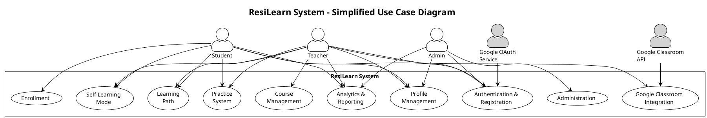
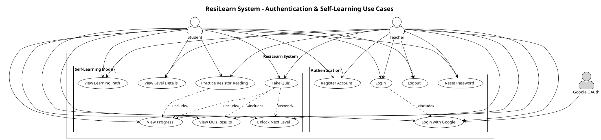
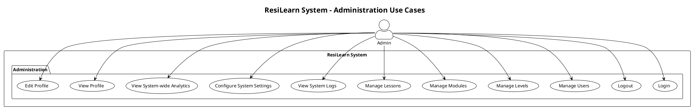

# Use Case Diagram - ResiLearn System (PlantUML)

## Use Case Diagram (Complete - PlantUML)

**หมายเหตุ:** Diagram นี้แสดง Use Cases ทั้งหมด 68 Use Cases สำหรับระบบ ResiLearn

```plantuml
@startuml ResiLearn_UseCase
!theme plain
skinparam packageStyle rectangle
skinparam actorStyle awesome

title ResiLearn System Use Case Diagram

' Actors
actor Student as student
actor Teacher as teacher
actor Admin as admin
actor "Google OAuth\nService" as googleOAuth #LightGray
actor "Google Classroom\nAPI" as googleClassroom #LightGray

' System Boundary
rectangle "ResiLearn System" {
    
    ' Authentication & Registration
    package "Authentication & Registration" {
        usecase UC1 as "Register Account"
        usecase UC2 as "Login"
        usecase UC3 as "Logout"
        usecase UC4 as "Reset Password"
        usecase UC5 as "Login with Google"
    }
    
    ' Self-Learning Mode
    package "Self-Learning Mode" {
        usecase UC6 as "View Learning Path"
        usecase UC7 as "View Level Details"
        usecase UC8 as "Practice Resistor Reading"
        usecase UC9 as "Take Quiz"
        usecase UC10 as "View Quiz Results"
        usecase UC11 as "View Progress"
        usecase UC12 as "Unlock Next Level"
    }
    
    ' Practice System
    package "Practice System" {
        usecase UC13 as "Quick Practice"
        usecase UC14 as "Custom Practice"
        usecase UC15 as "Create Practice Preset"
        usecase UC16 as "Color Reading Practice"
        usecase UC17 as "View Practice Sessions"
        usecase UC18 as "View Practice Analytics"
    }
    
    ' Learning Path
    package "Learning Path" {
        usecase UC19 as "View Modules"
        usecase UC20 as "View Lessons"
        usecase UC21 as "Read Lesson Content"
        usecase UC22 as "Complete Lesson"
        usecase UC23 as "Track Module Progress"
    }
    
    ' Course Management
    package "Course Management" {
        usecase UC24 as "Create Course"
        usecase UC25 as "Edit Course"
        usecase UC26 as "Delete Course"
        usecase UC27 as "Publish Course"
        usecase UC28 as "Assign Levels to Course"
        usecase UC29 as "Set Assignment Due Dates"
        usecase UC30 as "Create Announcement"
        usecase UC31 as "Edit Announcement"
        usecase UC32 as "Delete Announcement"
    }
    
    ' Enrollment
    package "Enrollment" {
        usecase UC33 as "Enroll in Course"
        usecase UC34 as "View Enrolled Courses"
        usecase UC35 as "View Course Details"
        usecase UC36 as "View Course Assignments"
        usecase UC37 as "View Course Announcements"
        usecase UC38 as "View Classmates"
        usecase UC39 as "Unenroll from Course"
    }
    
    ' Course Learning
    package "Course Learning" {
        usecase UC40 as "Complete Course Assignment"
        usecase UC41 as "View Course Progress"
        usecase UC42 as "View Course Dashboard"
    }
    
    ' Google Classroom Integration
    package "Google Classroom Integration" {
        usecase UC43 as "Connect Google Classroom"
        usecase UC44 as "Import Students from Classroom"
        usecase UC45 as "Sync Course to Classroom"
        usecase UC46 as "Create Classroom Assignment"
        usecase UC47 as "Sync Grades to Classroom"
        usecase UC48 as "Auto-sync Grades"
        usecase UC49 as "View Sync Status"
    }
    
    ' Analytics & Reporting
    package "Analytics & Reporting" {
        usecase UC50 as "View Personal Dashboard"
        usecase UC51 as "View Self-Learning Statistics"
        usecase UC52 as "View Course Statistics"
        usecase UC53 as "View Practice Analytics"
        usecase UC54 as "View Student Progress"
        usecase UC55 as "View Course Analytics"
        usecase UC56 as "View Student Performance"
        usecase UC57 as "Export Reports"
        usecase UC58 as "View System-wide Analytics"
    }
    
    ' Profile Management
    package "Profile Management" {
        usecase UC59 as "View Profile"
        usecase UC60 as "Edit Profile"
        usecase UC61 as "Change Password"
        usecase UC62 as "Link Google Account"
    }
    
    ' Administration
    package "Administration" {
        usecase UC63 as "Manage Users"
        usecase UC64 as "Manage Levels"
        usecase UC65 as "Manage Modules"
        usecase UC66 as "Manage Lessons"
        usecase UC67 as "View System Logs"
        usecase UC68 as "Configure System Settings"
    }
}

' Student associations
student --> UC1
student --> UC2
student --> UC3
student --> UC4
student --> UC5
student --> UC6
student --> UC7
student --> UC8
student --> UC9
student --> UC10
student --> UC11
student --> UC12
student --> UC13
student --> UC14
student --> UC15
student --> UC16
student --> UC17
student --> UC18
student --> UC19
student --> UC20
student --> UC21
student --> UC22
student --> UC23
student --> UC33
student --> UC34
student --> UC35
student --> UC36
student --> UC37
student --> UC38
student --> UC39
student --> UC40
student --> UC41
student --> UC42
student --> UC50
student --> UC51
student --> UC52
student --> UC53
student --> UC59
student --> UC60
student --> UC61
student --> UC62

' Teacher associations
teacher --> UC1
teacher --> UC2
teacher --> UC3
teacher --> UC4
teacher --> UC5
teacher --> UC6
teacher --> UC7
teacher --> UC8
teacher --> UC9
teacher --> UC10
teacher --> UC11
teacher --> UC12
teacher --> UC13
teacher --> UC14
teacher --> UC15
teacher --> UC16
teacher --> UC17
teacher --> UC18
teacher --> UC19
teacher --> UC20
teacher --> UC21
teacher --> UC22
teacher --> UC23
teacher --> UC24
teacher --> UC25
teacher --> UC26
teacher --> UC27
teacher --> UC28
teacher --> UC29
teacher --> UC30
teacher --> UC31
teacher --> UC32
teacher --> UC43
teacher --> UC44
teacher --> UC45
teacher --> UC46
teacher --> UC47
teacher --> UC48
teacher --> UC49
teacher --> UC50
teacher --> UC51
teacher --> UC52
teacher --> UC53
teacher --> UC54
teacher --> UC55
teacher --> UC56
teacher --> UC57
teacher --> UC59
teacher --> UC60
teacher --> UC61
teacher --> UC62

' Admin associations
admin --> UC2
admin --> UC3
admin --> UC50
admin --> UC58
admin --> UC63
admin --> UC64
admin --> UC65
admin --> UC66
admin --> UC67
admin --> UC68
admin --> UC59
admin --> UC60

' External system associations
googleOAuth --> UC5
googleClassroom --> UC43
googleClassroom --> UC44
googleClassroom --> UC45
googleClassroom --> UC46
googleClassroom --> UC47
googleClassroom --> UC48

' Include relationships
UC2 ..> UC5 : <<include>>
UC9 ..> UC10 : <<include>>
UC8 ..> UC11 : <<include>>
UC9 ..> UC11 : <<include>>
UC40 ..> UC41 : <<include>>
UC47 ..> UC48 : <<include>>
UC24 ..> UC28 : <<include>>
UC28 ..> UC29 : <<include>>

' Extend relationships
UC9 ..> UC12 : <<extend>>
UC22 ..> UC23 : <<extend>>
UC40 ..> UC42 : <<extend>>

@enduml
```

---

## Use Case Diagram (Simplified - Grouped by Feature)

---

## Use Case Diagram (Actor-Centric View)

```plantuml
@startuml ResiLearn_UseCase_ActorCentric
!theme plain
skinparam actorStyle awesome

title ResiLearn System - Actor-Centric Use Case Diagram

actor Student as student
actor Teacher as teacher
actor Admin as admin

rectangle "Student View" {
    usecase "Register/Login" as S1
    usecase "Self-Learning" as S2
    usecase "Practice" as S3
    usecase "Enroll Course" as S4
    usecase "View Dashboard" as S5
    usecase "View Progress" as S6
}

rectangle "Teacher View" {
    usecase "Register/Login" as T1
    usecase "Create Course" as T2
    usecase "Assign Levels" as T3
    usecase "View Analytics" as T4
    usecase "Google Sync" as T5
    usecase "Manage Students" as T6
}

rectangle "Admin View" {
    usecase "Login" as A1
    usecase "Manage Users" as A2
    usecase "Manage Content" as A3
    usecase "System Analytics" as A4
}

student --> S1
student --> S2
student --> S3
student --> S4
student --> S5
student --> S6

teacher --> T1
teacher --> T2
teacher --> T3
teacher --> T4
teacher --> T5
teacher --> T6

admin --> A1
admin --> A2
admin --> A3
admin --> A4

@enduml
```

---

## Use Case Diagram (Detailed by Feature - Part 1: Authentication & Self-Learning)

---

## Use Case Diagram (Detailed by Feature - Part 2: Course Management)

```plantuml
@startuml ResiLearn_UseCase_Detail2
!theme plain
skinparam actorStyle awesome

title ResiLearn System - Course Management Use Cases

actor Student as student
actor Teacher as teacher
actor "Google Classroom" as googleClassroom #LightGray

rectangle "ResiLearn System" {
    
    package "Course Management" {
        usecase "Create Course" as UC24
        usecase "Edit Course" as UC25
        usecase "Delete Course" as UC26
        usecase "Publish Course" as UC27
        usecase "Assign Levels to Course" as UC28
        usecase "Set Assignment Due Dates" as UC29
        usecase "Create Announcement" as UC30
        usecase "Edit Announcement" as UC31
        usecase "Delete Announcement" as UC32
    }
    
    package "Enrollment" {
        usecase "Enroll in Course" as UC33
        usecase "View Enrolled Courses" as UC34
        usecase "View Course Details" as UC35
        usecase "View Course Assignments" as UC36
        usecase "View Course Announcements" as UC37
        usecase "View Classmates" as UC38
        usecase "Unenroll from Course" as UC39
    }
    
    package "Course Learning" {
        usecase "Complete Course Assignment" as UC40
        usecase "View Course Progress" as UC41
        usecase "View Course Dashboard" as UC42
    }
    
    package "Google Integration" {
        usecase "Connect Google Classroom" as UC43
        usecase "Import Students" as UC44
        usecase "Sync Course to Classroom" as UC45
        usecase "Create Classroom Assignment" as UC46
        usecase "Sync Grades to Classroom" as UC47
        usecase "Auto-sync Grades" as UC48
        usecase "View Sync Status" as UC49
    }
}

teacher --> UC24
teacher --> UC25
teacher --> UC26
teacher --> UC27
teacher --> UC28
teacher --> UC29
teacher --> UC30
teacher --> UC31
teacher --> UC32
teacher --> UC43
teacher --> UC44
teacher --> UC45
teacher --> UC46
teacher --> UC47
teacher --> UC48
teacher --> UC49

student --> UC33
student --> UC34
student --> UC35
student --> UC36
student --> UC37
student --> UC38
student --> UC39
student --> UC40
student --> UC41
student --> UC42

googleClassroom --> UC43
googleClassroom --> UC44
googleClassroom --> UC45
googleClassroom --> UC46
googleClassroom --> UC47
googleClassroom --> UC48

UC24 ..> UC28 : <<include>>
UC28 ..> UC29 : <<include>>
UC40 ..> UC41 : <<include>>
UC40 ..> UC42 : <<extend>>
UC47 ..> UC48 : <<include>>

@enduml
```

---

## Use Case Diagram (Detailed by Feature - Part 3: Practice & Analytics)

```plantuml
@startuml ResiLearn_UseCase_Detail3
!theme plain
skinparam actorStyle awesome

title ResiLearn System - Practice & Analytics Use Cases

actor Student as student
actor Teacher as teacher
actor Admin as admin

rectangle "ResiLearn System" {
    
    package "Practice System" {
        usecase "Quick Practice" as UC13
        usecase "Custom Practice" as UC14
        usecase "Create Practice Preset" as UC15
        usecase "Color Reading Practice" as UC16
        usecase "View Practice Sessions" as UC17
        usecase "View Practice Analytics" as UC18
    }
    
    package "Learning Path" {
        usecase "View Modules" as UC19
        usecase "View Lessons" as UC20
        usecase "Read Lesson Content" as UC21
        usecase "Complete Lesson" as UC22
        usecase "Track Module Progress" as UC23
    }
    
    package "Analytics & Reporting" {
        usecase "View Personal Dashboard" as UC50
        usecase "View Self-Learning Statistics" as UC51
        usecase "View Course Statistics" as UC52
        usecase "View Practice Analytics" as UC53
        usecase "View Student Progress" as UC54
        usecase "View Course Analytics" as UC55
        usecase "View Student Performance" as UC56
        usecase "Export Reports" as UC57
        usecase "View System-wide Analytics" as UC58
    }
    
    package "Profile Management" {
        usecase "View Profile" as UC59
        usecase "Edit Profile" as UC60
        usecase "Change Password" as UC61
        usecase "Link Google Account" as UC62
    }
}

student --> UC13
student --> UC14
student --> UC15
student --> UC16
student --> UC17
student --> UC18
student --> UC19
student --> UC20
student --> UC21
student --> UC22
student --> UC23
student --> UC50
student --> UC51
student --> UC52
student --> UC53
student --> UC59
student --> UC60
student --> UC61
student --> UC62

teacher --> UC13
teacher --> UC14
teacher --> UC15
teacher --> UC16
teacher --> UC17
teacher --> UC18
teacher --> UC19
teacher --> UC20
teacher --> UC21
teacher --> UC22
teacher --> UC23
teacher --> UC50
teacher --> UC51
teacher --> UC52
teacher --> UC53
teacher --> UC54
teacher --> UC55
teacher --> UC56
teacher --> UC57
teacher --> UC59
teacher --> UC60
teacher --> UC61
teacher --> UC62

admin --> UC50
admin --> UC58
admin --> UC59
admin --> UC60

UC22 ..> UC23 : <<extend>>

@enduml
```

---

## Use Case Diagram (Administration)

---

## Detailed Use Case List

### Authentication & Registration
1. **Register Account** - สมัครสมาชิก (Student/Teacher)
2. **Login** - เข้าสู่ระบบ (Credentials)
3. **Logout** - ออกจากระบบ
4. **Reset Password** - รีเซ็ตรหัสผ่าน
5. **Login with Google** - เข้าสู่ระบบด้วย Google OAuth

### Self-Learning Mode
6. **View Learning Path** - ดู Learning Path (7 Levels)
7. **View Level Details** - ดูรายละเอียด Level
8. **Practice Resistor Reading** - ฝึกอ่านค่าตัวต้านทาน (Practice Mode)
9. **Take Quiz** - ทำแบบทดสอบ (Quiz Mode)
10. **View Quiz Results** - ดูผลการทำแบบทดสอบ
11. **View Progress** - ดูความคืบหน้า
12. **Unlock Next Level** - ปลดล็อก Level ถัดไป (เมื่อผ่าน Level ปัจจุบัน)

### Practice System
13. **Quick Practice** - ฝึกแบบด่วน (ตั้งค่าด่วน)
14. **Custom Practice** - ฝึกแบบกำหนดเอง
15. **Create Practice Preset** - สร้าง Preset สำหรับฝึก
16. **Color Reading Practice** - ฝึกอ่านค่ารหัสสี (แบบต่างๆ)
17. **View Practice Sessions** - ดูประวัติการฝึก
18. **View Practice Analytics** - ดูสถิติการฝึก

### Learning Path
19. **View Modules** - ดู Modules ทั้งหมด
20. **View Lessons** - ดู Lessons ใน Module
21. **Read Lesson Content** - อ่านเนื้อหา Lesson
22. **Complete Lesson** - ทำ Lesson เสร็จ
23. **Track Module Progress** - ติดตามความคืบหน้า Module

### Course Management (Teacher Only)
24. **Create Course** - สร้าง Course
25. **Edit Course** - แก้ไข Course
26. **Delete Course** - ลบ Course
27. **Publish Course** - เผยแพร่ Course
28. **Assign Levels to Course** - กำหนด Levels เป็น Assignments
29. **Set Assignment Due Dates** - กำหนดวันครบกำหนด
30. **Create Announcement** - สร้างประกาศ
31. **Edit Announcement** - แก้ไขประกาศ
32. **Delete Announcement** - ลบประกาศ

### Enrollment
33. **Enroll in Course** - ลงทะเบียนเรียน Course
34. **View Enrolled Courses** - ดู Courses ที่ลงทะเบียนแล้ว
35. **View Course Details** - ดูรายละเอียด Course
36. **View Course Assignments** - ดู Assignments ใน Course
37. **View Course Announcements** - ดูประกาศใน Course
38. **View Classmates** - ดูเพื่อนร่วมชั้น
39. **Unenroll from Course** - ยกเลิกการลงทะเบียน

### Course Learning
40. **Complete Course Assignment** - ทำ Assignment ใน Course
41. **View Course Progress** - ดูความคืบหน้าใน Course
42. **View Course Dashboard** - ดู Dashboard ของ Course

### Google Classroom Integration
43. **Connect Google Classroom** - เชื่อมต่อ Google Classroom
44. **Import Students from Classroom** - นำเข้า Students จาก Classroom
45. **Sync Course to Classroom** - Sync Course ไปยัง Classroom
46. **Create Classroom Assignment** - สร้าง Assignment ใน Classroom
47. **Sync Grades to Classroom** - Sync คะแนนไปยัง Classroom
48. **Auto-sync Grades** - Sync คะแนนอัตโนมัติ
49. **View Sync Status** - ดูสถานะการ Sync

### Analytics & Reporting
50. **View Personal Dashboard** - ดู Dashboard ส่วนตัว
51. **View Self-Learning Statistics** - ดูสถิติ Self-Learning
52. **View Course Statistics** - ดูสถิติ Course
53. **View Practice Analytics** - ดูสถิติการฝึก
54. **View Student Progress** - ดูความคืบหน้าของ Student (Teacher)
55. **View Course Analytics** - ดูสถิติ Course (Teacher)
56. **View Student Performance** - ดูผลการเรียนของ Student (Teacher)
57. **Export Reports** - ส่งออกรายงาน
58. **View System-wide Analytics** - ดูสถิติทั้งระบบ (Admin)

### Profile Management
59. **View Profile** - ดู Profile
60. **Edit Profile** - แก้ไข Profile
61. **Change Password** - เปลี่ยนรหัสผ่าน
62. **Link Google Account** - เชื่อมต่อบัญชี Google

### Administration (Admin Only)
63. **Manage Users** - จัดการ Users
64. **Manage Levels** - จัดการ Levels
65. **Manage Modules** - จัดการ Modules
66. **Manage Lessons** - จัดการ Lessons
67. **View System Logs** - ดู System Logs
68. **Configure System Settings** - กำหนดค่าระบบ

---

## Use Case Relationships

### Include Relationships (<<include>>)
- **Login** includes **Login with Google** (optional)
- **Take Quiz** includes **View Quiz Results**
- **Practice Resistor Reading** includes **View Progress**
- **Take Quiz** includes **View Progress**
- **Complete Course Assignment** includes **View Course Progress**
- **Sync Grades to Classroom** includes **Auto-sync Grades**
- **Create Course** includes **Assign Levels to Course**
- **Assign Levels to Course** includes **Set Assignment Due Dates**

### Extend Relationships (<<extend>>)
- **Take Quiz** extends **Unlock Next Level** (when passed)
- **Complete Lesson** extends **Track Module Progress**
- **Complete Course Assignment** extends **View Course Dashboard**

### Generalization
- **Student** และ **Teacher** เป็น subtypes ของ **User**
- ทั้ง **Student** และ **Teacher** สามารถใช้ Self-Learning Mode ได้
- **Teacher** มีสิทธิ์เพิ่มเติมในการจัดการ Course

---

## Actor Descriptions

### Student (ผู้เรียน)
- ลงทะเบียนและเข้าสู่ระบบ
- เรียนรู้แบบ Self-Learning (7 Levels)
- ฝึก Practice แบบต่างๆ
- ลงทะเบียนเรียน Course
- ทำ Assignments ที่ครูกำหนด
- ดู Dashboard และ Progress

### Teacher (ครู)
- ลงทะเบียนและเข้าสู่ระบบ
- ใช้ Self-Learning Mode (เช่นเดียวกับ Student)
- สร้างและจัดการ Course
- กำหนด Assignments
- เชื่อมต่อ Google Classroom
- Import Students
- Sync Grades
- ดู Analytics และ Student Progress

### Admin (ผู้ดูแลระบบ)
- เข้าสู่ระบบ
- จัดการ Users, Levels, Modules, Lessons
- ดู System-wide Analytics
- กำหนดค่าระบบ

### External Systems
- **Google OAuth Service** - ให้บริการ Authentication
- **Google Classroom API** - ให้บริการ Classroom Integration

---

## Use Case Priority

### High Priority (Core Features)
- Authentication (UC1-UC5)
- Self-Learning Mode (UC6-UC12)
- Practice System (UC13-UC18)
- Course Management (UC24-UC32)
- Enrollment (UC33-UC39)

### Medium Priority (Important Features)
- Learning Path (UC19-UC23)
- Google Classroom Integration (UC43-UC49)
- Analytics (UC50-UC57)

### Low Priority (Nice to Have)
- Profile Management (UC59-UC62)
- Administration (UC63-UC68)

---

## Use Case Statistics

### Total Use Cases: 68

**By Actor:**
- **Student:** 42 use cases
- **Teacher:** 50 use cases (includes all Student use cases + Teacher-specific)
- **Admin:** 10 use cases

**By Feature Group:**
- Authentication & Registration: 5
- Self-Learning Mode: 7
- Practice System: 6
- Learning Path: 5
- Course Management: 9
- Enrollment: 7
- Course Learning: 3
- Google Classroom Integration: 7
- Analytics & Reporting: 9
- Profile Management: 4
- Administration: 6

**By Priority:**
- High Priority: 35 use cases
- Medium Priority: 20 use cases
- Low Priority: 13 use cases

---

## Use Case Descriptions (Key Use Cases)

### UC1: Register Account
**Actor:** Student, Teacher  
**Description:** ผู้ใช้สมัครสมาชิกใหม่โดยกรอกข้อมูล email, password, name และเลือก role (Student/Teacher)  
**Preconditions:** ไม่มี  
**Postconditions:** สร้าง User account ใหม่ในระบบ  
**Main Flow:**
1. ผู้ใช้เข้าหน้า Register
2. กรอกข้อมูล (email, password, name, role)
3. ระบบตรวจสอบ email ไม่ซ้ำ
4. Hash password ด้วย bcrypt
5. สร้าง User ใน database
6. Redirect ไปหน้า Login

### UC9: Take Quiz
**Actor:** Student, Teacher  
**Description:** ทำแบบทดสอบใน Level ที่กำหนด มีเวลาและบันทึกคะแนน  
**Preconditions:** User ต้อง Login และ Level ต้อง Unlock แล้ว  
**Postconditions:** บันทึก LevelAttempt ใน database, Unlock Level ถัดไปถ้าผ่าน  
**Main Flow:**
1. ผู้ใช้เลือก Level และกด "Take Quiz"
2. ระบบ Generate Questions แบบ Dynamic
3. แสดงคำถามทีละข้อพร้อม Timer
4. ผู้ใช้ตอบคำถาม
5. Submit เมื่อเสร็จหรือหมดเวลา
6. ระบบคำนวณคะแนน
7. บันทึก LevelAttempt
8. ถ้าคะแนน >= 80% → Unlock Level ถัดไป
9. แสดงผลลัพธ์

### UC24: Create Course
**Actor:** Teacher  
**Description:** ครูสร้าง Course ใหม่  
**Preconditions:** Teacher ต้อง Login  
**Postconditions:** สร้าง Course ใน database  
**Main Flow:**
1. Teacher เข้าหน้า Create Course
2. กรอกข้อมูล Course (name, description, code)
3. ระบบตรวจสอบ Course code ไม่ซ้ำ
4. สร้าง Course ใน database
5. Redirect ไปหน้า Course Management

### UC43: Connect Google Classroom
**Actor:** Teacher  
**Description:** ครูเชื่อมต่อ Google Classroom account  
**Preconditions:** Teacher ต้อง Login  
**Postconditions:** บันทึก GoogleClassroomSync ใน database  
**Main Flow:**
1. Teacher กด "Connect Google Classroom"
2. Redirect ไป Google OAuth
3. Teacher อนุญาตการเข้าถึง
4. ระบบได้รับ Access Token
5. เรียก Google Classroom API เพื่อดึง Classrooms
6. Teacher เลือก Classroom
7. บันทึก GoogleClassroomSync

### UC47: Sync Grades to Classroom
**Actor:** Teacher (System)  
**Description:** Sync คะแนน Quiz ไปยัง Google Classroom Gradebook  
**Preconditions:** Course ต้องเชื่อมต่อกับ Google Classroom แล้ว  
**Postconditions:** คะแนนถูก Sync ไปยัง Classroom  
**Main Flow:**
1. Student ทำ Quiz เสร็จ
2. ระบบคำนวณคะแนน
3. ตรวจสอบว่า Course มี Google Classroom Sync
4. เรียก Google Classroom API
5. Update Grade ใน Classroom Gradebook
6. บันทึก Sync Status

---

## PlantUML Usage Instructions

### วิธีใช้ PlantUML Diagrams

1. **Online Editor:**
   - ไปที่ http://www.plantuml.com/plantuml/uml/
   - Copy code จาก `@startuml` ถึง `@enduml`
   - Paste และกด Submit
   - Export เป็น PNG, SVG, หรือ PDF

2. **VS Code Extension:**
   - ติดตั้ง PlantUML extension
   - สร้างไฟล์ `.puml` หรือ `.plantuml`
   - Copy code และ Preview

3. **Local Installation:**
   - ติดตั้ง Java และ PlantUML JAR
   - ใช้ command line หรือ IDE plugin

4. **GitHub/GitLab:**
   - GitHub และ GitLab รองรับ PlantUML โดยอัตโนมัติ
   - เพิ่ม code block ใน Markdown

### Diagram Files
- **Complete Diagram:** ใช้สำหรับภาพรวมทั้งหมด (อาจใหญ่เกินไป)
- **Simplified Diagram:** ใช้สำหรับนำเสนอแบบสรุป
- **Actor-Centric:** ใช้สำหรับแสดงตามมุมมอง Actor
- **Detailed by Feature:** แบ่งเป็น 3 ส่วน (Part 1-3) + Admin
- **Administration:** แสดงเฉพาะ Admin use cases

---

## Notes for Implementation

1. **Authentication Flow:**
   - Student/Teacher สามารถ Login ด้วย Credentials หรือ Google OAuth
   - Session ใช้ JWT tokens

2. **Progressive Learning:**
   - ต้องผ่าน Level ก่อนถึงจะ Unlock Level ถัดไป
   - Pass criteria: 80% score + Complete all questions

3. **Course Management:**
   - Teacher สร้าง Course และ Assign Levels
   - Student Enroll และทำ Assignments
   - Progress ติดตามแยกกันระหว่าง Self-Learning และ Course

4. **Google Classroom Integration:**
   - Teacher เชื่อมต่อ Classroom และ Import Students
   - Grades Sync อัตโนมัติหรือ Manual

5. **Analytics:**
   - Student ดู Dashboard ส่วนตัว
   - Teacher ดู Course Analytics และ Student Progress
   - Admin ดู System-wide Analytics

---

## Use Case Diagram Usage

### สำหรับ DFD Analysis
- ใช้ Use Cases เหล่านี้เพื่อระบุ Processes ใน DFD
- แต่ละ Use Case อาจเป็น Process หรือ Sub-process ใน DFD Layer 1-2

### สำหรับ Threat Model
- ใช้ Use Cases เพื่อระบุ Entry Points ของระบบ
- วิเคราะห์ Threats ที่อาจเกิดขึ้นในแต่ละ Use Case
- ระบุ Trust Boundaries ระหว่าง Actors และ System

### สำหรับ System Design
- ใช้ Use Cases เป็น Requirements
- แต่ละ Use Case ควรมี Implementation ในระบบ
- ใช้เป็น Checklist สำหรับการทดสอบระบบ
