# แผนผังการทำงาน/หลักการทำงาน/ผังงานของโปรเจ็ค

## บทนำ

เอกสารนี้อธิบายแผนผังการทำงาน หลักการทำงาน และผังงานของระบบ ResiLearn ครอบคลุม System Architecture, Data Flow, User Flow, Database Schema, Component Architecture, API Structure, และ Flow ต่างๆ

## 1. System Architecture Overview

### 1.1 สถาปัตยกรรมระบบโดยรวม

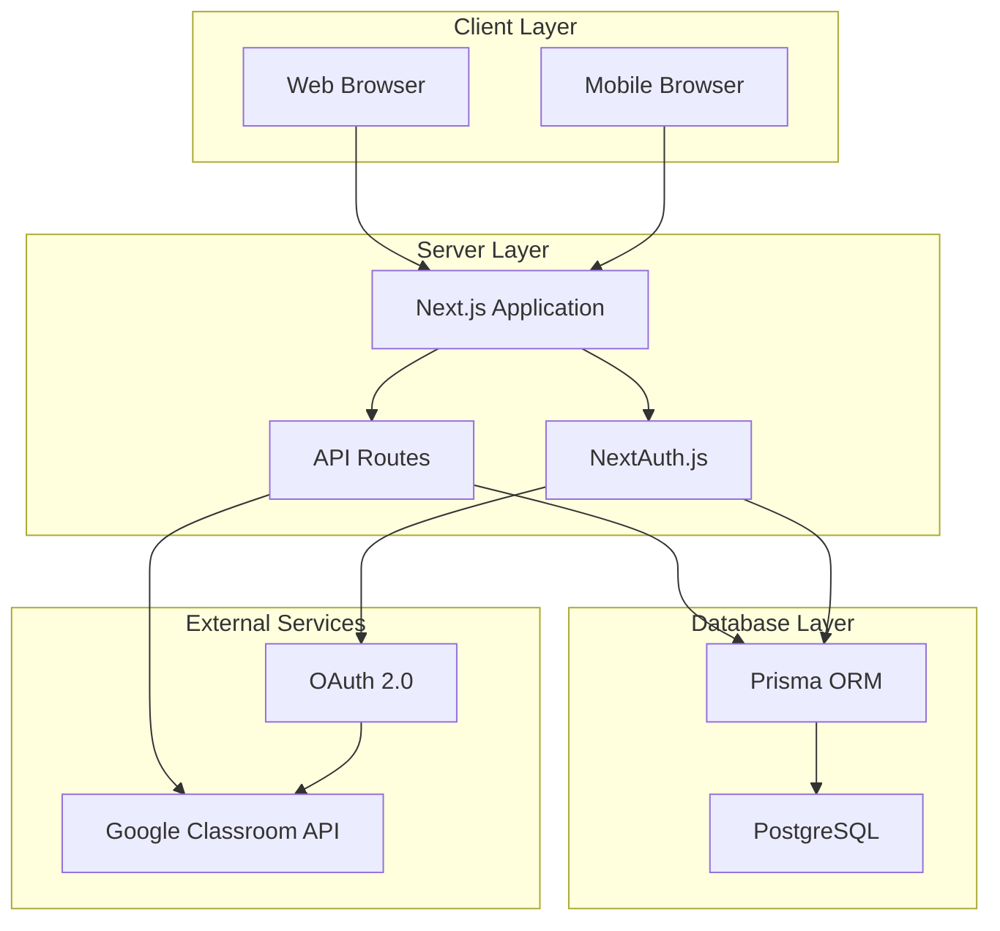

### 1.2 Tech Stack

- **Frontend**: Next.js 16 (App Router), React 19, TypeScript
- **Styling**: Tailwind CSS 4
- **Backend**: Next.js API Routes
- **Database**: PostgreSQL 15
- **ORM**: Prisma
- **Authentication**: NextAuth.js v5
- **3D Rendering**: Three.js, React Three Fiber
- **Charts**: Recharts
- **State Management**: Zustand, React Query

## 2. Database Schema

### 2.1 Entity Relationship Diagram

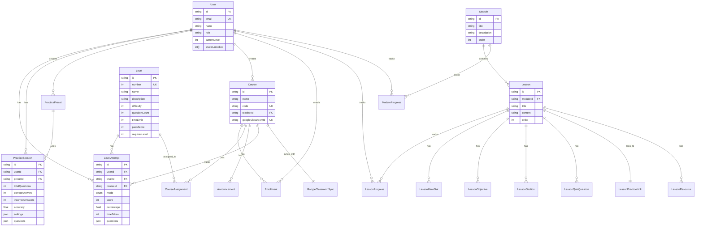

### 2.2 ตารางหลัก

#### 2.2.1 User และ Authentication
- `User`: ข้อมูลผู้ใช้
- `Account`: บัญชี OAuth
- `Session`: Session สำหรับ NextAuth

#### 2.2.2 Progressive Learning
- `Level`: ข้อมูล Level (1-7)
- `LevelAttempt`: ประวัติการทำ Quiz/Practice

#### 2.2.3 Practice System
- `PracticePreset`: การตั้งค่าการฝึกฝน
- `PracticeSession`: ประวัติการฝึกฝน

#### 2.2.4 LMS
- `Course`: ข้อมูลคอร์ส
- `Enrollment`: การลงทะเบียนเรียน
- `CourseAssignment`: การมอบหมายงาน
- `Announcement`: ประกาศ

#### 2.2.5 Learning Path
- `Module`: โมดูล
- `Lesson`: บทเรียน
- `LessonProgress`: ความคืบหน้าในบทเรียน
- `ModuleProgress`: ความคืบหน้าในโมดูล

#### 2.2.6 Google Classroom
- `GoogleClassroomSync`: การ sync กับ Classroom
- `ClassroomStudent`: นักเรียนจาก Classroom

## 3. User Flow Diagrams

### 3.1 Student Self-Learning Flow

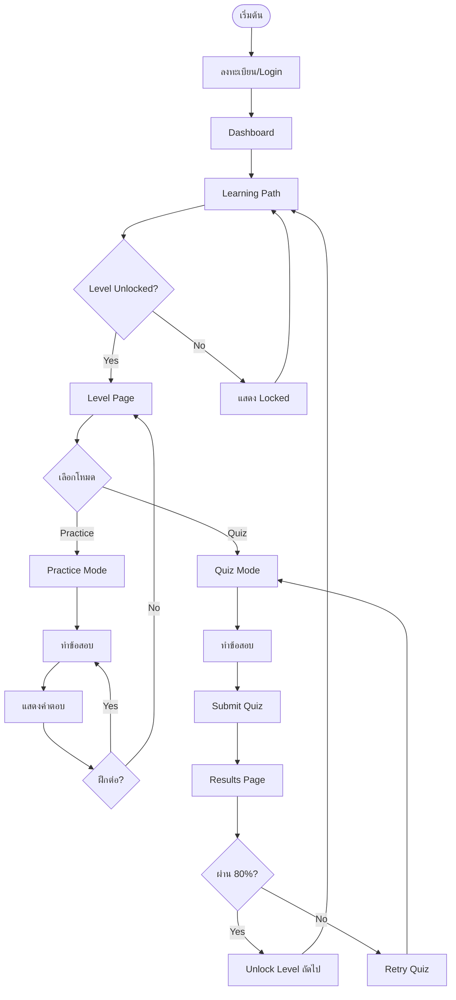

### 3.2 Teacher Course Management Flow

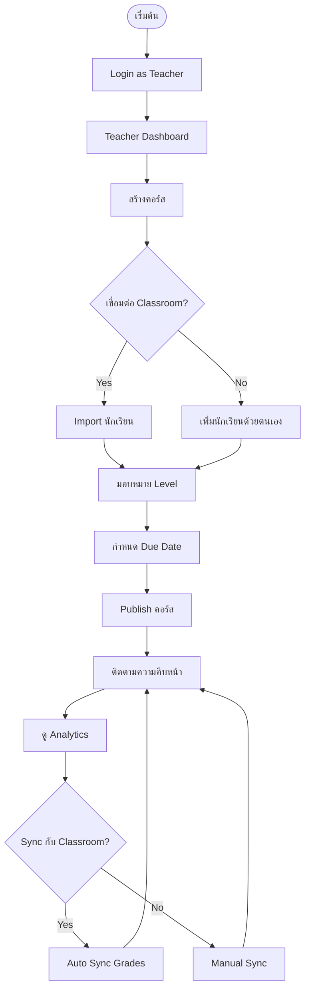

### 3.3 Student Course Flow

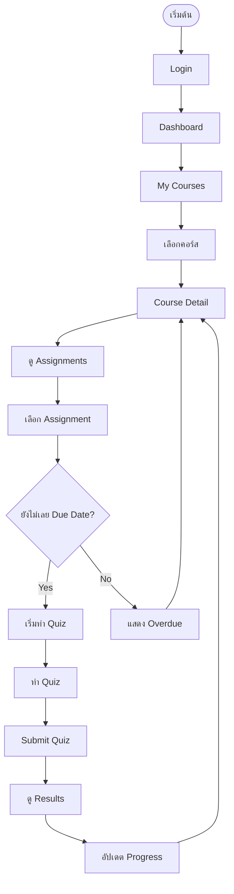

## 4. Data Flow Diagrams

### 4.1 Practice Session Data Flow

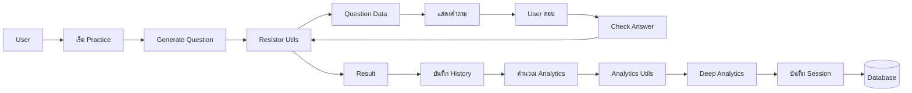

### 4.2 Analytics Processing Flow

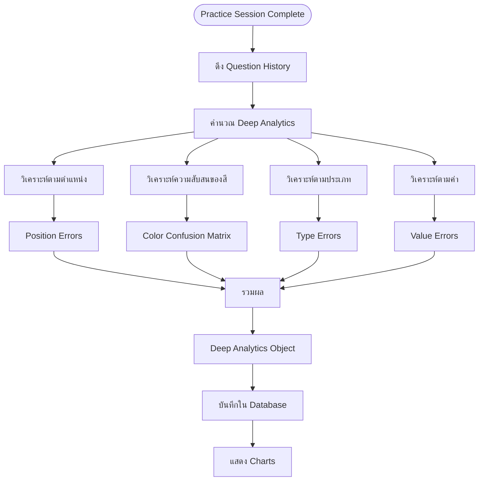

### 4.3 Google Classroom Sync Flow

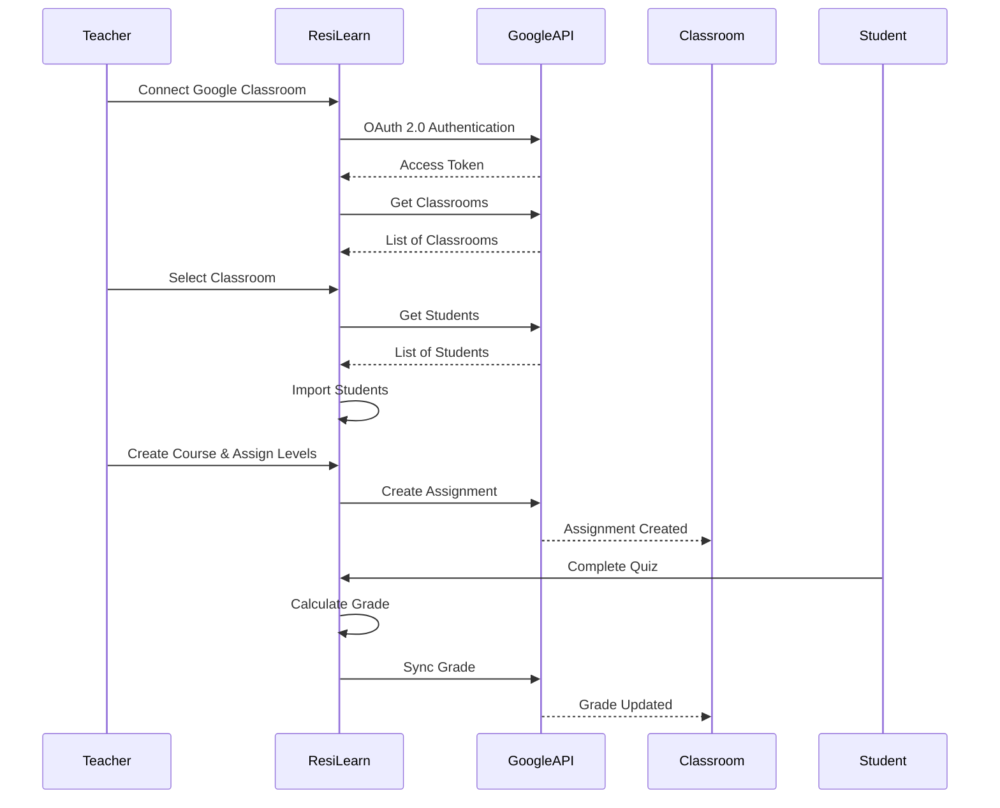

## 5. Component Architecture

### 5.1 Frontend Component Structure

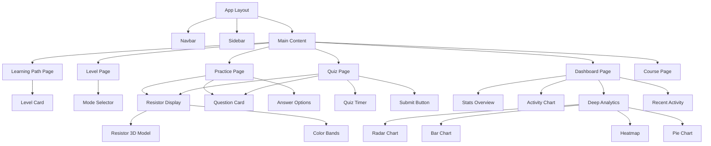

### 5.2 Component Hierarchy

```
App
├── Layout
│   ├── Navbar
│   ├── Sidebar
│   └── Main Content
├── Pages
│   ├── Learning Path
│   │   └── LevelCard[]
│   ├── Level Page
│   │   ├── LevelHeader
│   │   ├── LevelStats
│   │   └── ModeSelector
│   ├── Practice/Quiz Page
│   │   ├── ResistorDisplay
│   │   ├── QuestionCard
│   │   ├── AnswerOptions
│   │   └── QuizTimer (Quiz only)
│   ├── Dashboard
│   │   ├── StatsOverview
│   │   ├── ActivityChart
│   │   ├── DeepAnalytics
│   │   └── RecentActivity
│   └── Course Page
│       ├── CourseHeader
│       ├── AssignmentList
│       └── ProgressOverview
└── Components
    ├── Features
    │   ├── ResistorDisplay
    │   ├── ColorBandSelector
    │   └── Resistor3DModel
    ├── Analytics
    │   ├── DeepAnalyticsRadarChart
    │   ├── ErrorRateBarChart
    │   ├── ColorConfusionHeatmap
    │   └── ...
    └── Dashboard
        ├── StatsOverview
        ├── ActivityChart
        └── RecentActivityList
```

## 6. API Structure

### 6.1 API Endpoints

```mermaid
graph LR
    API[API Routes] --> AuthAPI[Auth API]
    API --> LevelsAPI[Levels API]
    API --> PracticeAPI[Practice API]
    API --> AnalyticsAPI[Analytics API]
    API --> CourseAPI[Course API]
    API --> ClassroomAPI[Classroom API]
    
    AuthAPI --> Login[POST /api/auth/login]
    AuthAPI --> Register[POST /api/auth/register]
    AuthAPI --> Session[GET /api/auth/session]
    
    LevelsAPI --> GetLevels[GET /api/levels]
    LevelsAPI --> GetLevel[GET /api/levels/[id]]
    LevelsAPI --> CreateAttempt[POST /api/attempts]
    
    PracticeAPI --> GetSessions[GET /api/practice-sessions]
    PracticeAPI --> CreateSession[POST /api/practice-sessions]
    PracticeAPI --> GetPresets[GET /api/practice-presets]
    
    AnalyticsAPI --> GetAnalytics[GET /api/analytics/practice]
    AnalyticsAPI --> GetSessionAnalytics[GET /api/analytics/session/[id]]
    
    CourseAPI --> GetCourses[GET /api/courses]
    CourseAPI --> CreateCourse[POST /api/courses]
    CourseAPI --> Enroll[POST /api/courses/[id]/enroll]
    
    ClassroomAPI --> Connect[POST /api/classroom/connect]
    ClassroomAPI --> Import[POST /api/classroom/import]
    ClassroomAPI --> Sync[POST /api/classroom/sync]
```

### 6.2 API Request/Response Flow

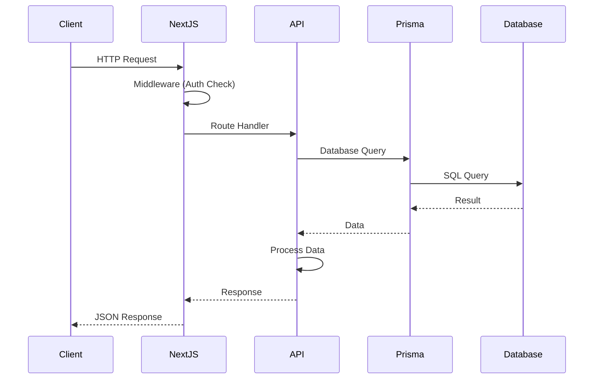

## 7. Authentication Flow

### 7.1 NextAuth.js Authentication Flow

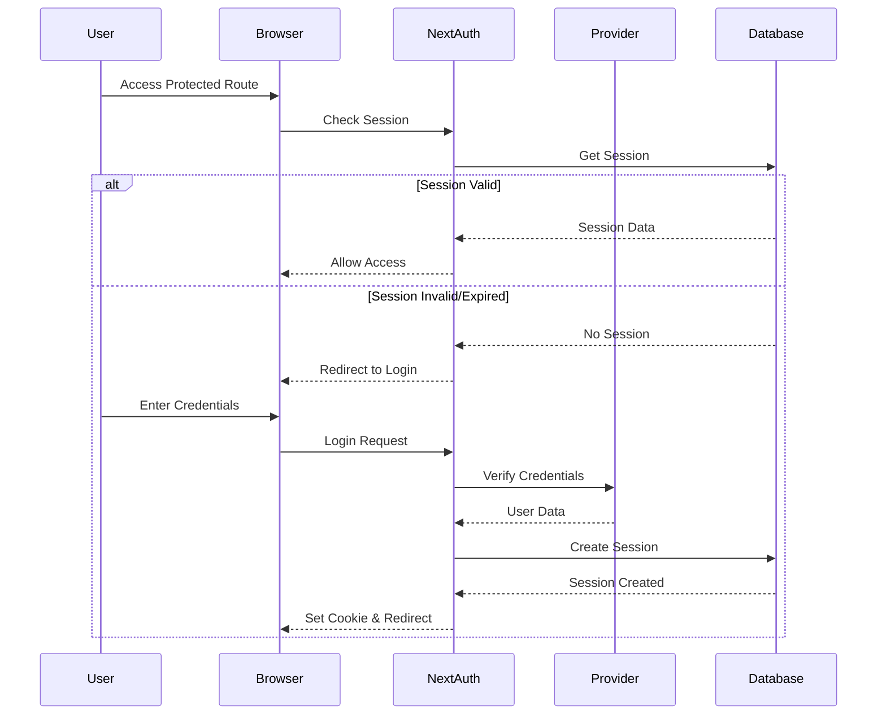

### 7.2 OAuth Flow (Google)

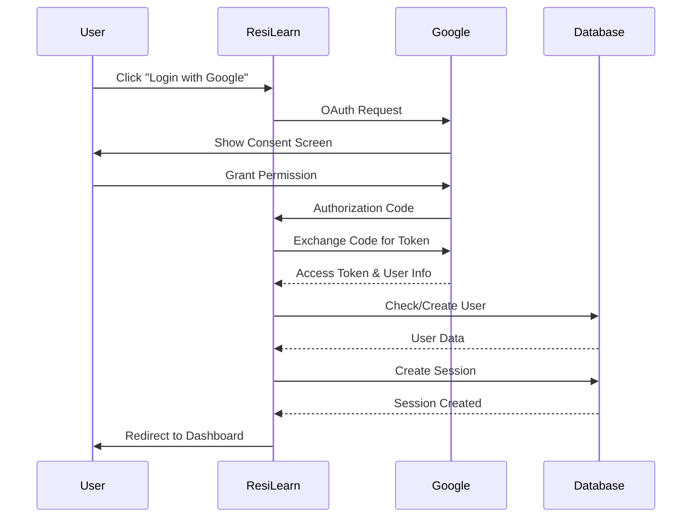

## 8. Progressive Learning Flow

### 8.1 Level Unlock Flow

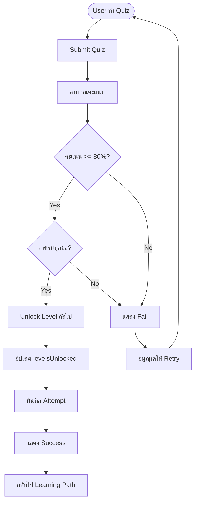

### 8.2 Question Generation Flow

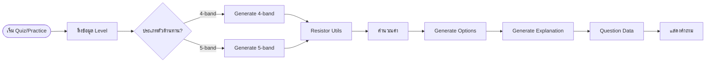

## 9. Analytics Processing Flow

### 9.1 Deep Analytics Calculation

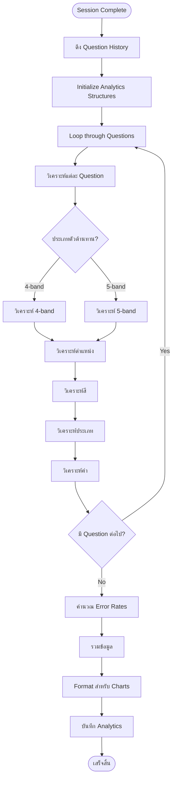

## 10. File Structure

### 10.1 Project Directory Structure

```
ResiLearn/
├── app/                          # Next.js App Router
│   ├── (auth)/                   # Auth routes
│   │   ├── login/
│   │   └── register/
│   ├── api/                      # API Routes
│   │   ├── auth/
│   │   ├── levels/
│   │   ├── practice-sessions/
│   │   ├── analytics/
│   │   └── courses/
│   ├── learn/                    # Learning routes
│   │   └── self/
│   │       ├── dashboard/
│   │       ├── learningpath/
│   │       ├── levels/
│   │       └── practice/
│   └── page.tsx                  # Landing page
├── components/                   # React Components
│   ├── analytics/                # Analytics components
│   ├── dashboard/                # Dashboard components
│   ├── features/                 # Feature components
│   └── layout/                   # Layout components
├── lib/                          # Utility libraries
│   ├── analyticsUtils.ts         # Analytics calculations
│   ├── resistorUtils.ts          # Resistor calculations
│   ├── auth.ts                   # Authentication
│   └── db.ts                     # Database connection
├── prisma/                       # Prisma schema
│   ├── schema.prisma
│   └── seed.ts
└── public/                       # Static files
```

## 11. สรุป

ระบบ ResiLearn มีสถาปัตยกรรมที่ประกอบด้วย:

1. **Client-Server Architecture**: Next.js เป็น Full-stack Framework
2. **Database Layer**: PostgreSQL กับ Prisma ORM
3. **Authentication**: NextAuth.js กับ OAuth 2.0
4. **Component-based UI**: React Components ที่แยกส่วนชัดเจน
5. **API Routes**: RESTful API สำหรับการสื่อสาร
6. **External Integration**: Google Classroom API

ระบบนี้รองรับ:
- Progressive Learning (7 Levels)
- Deep Analytics
- Dual Mode (Self-Learning + Course)
- Google Classroom Integration
- Real-time Updates
- Scalable Architecture

สถาปัตยกรรมนี้ทำให้ระบบมีความยืดหยุ่น รองรับการขยายตัว และง่ายต่อการดูแลรักษา

