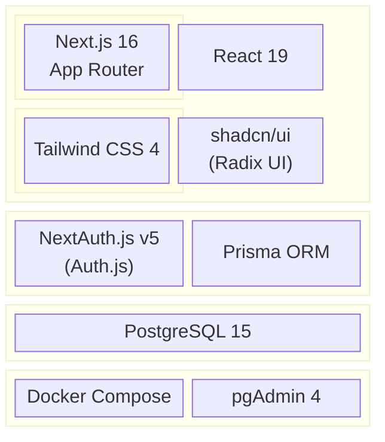
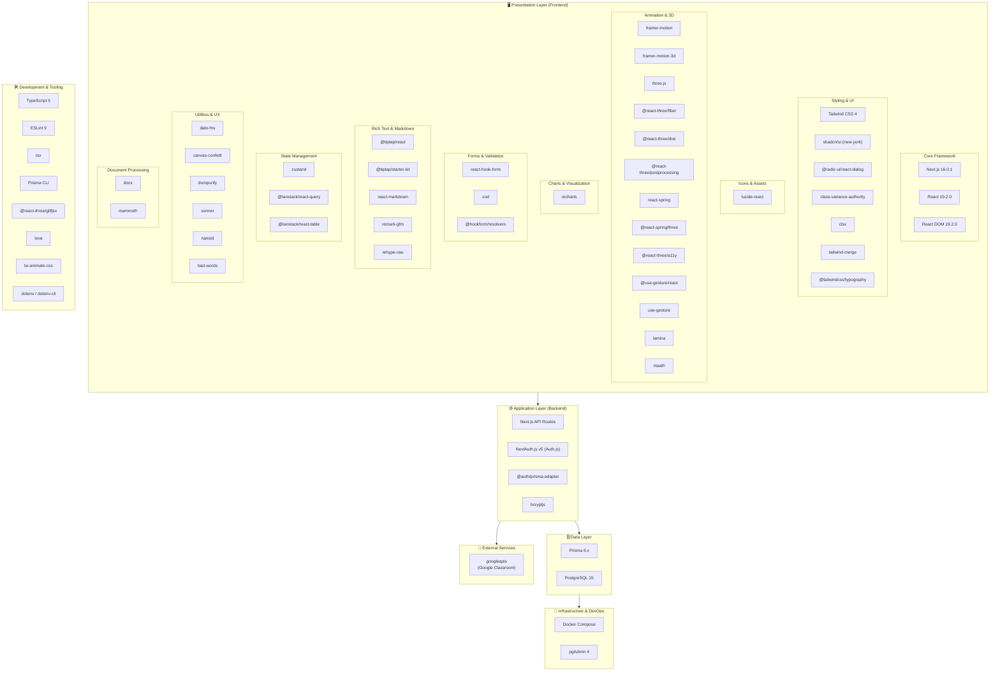
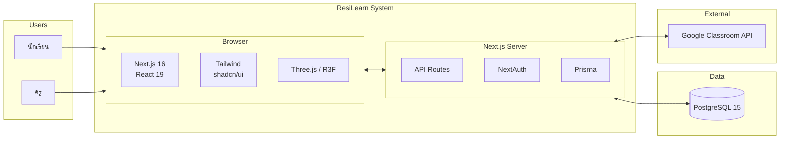
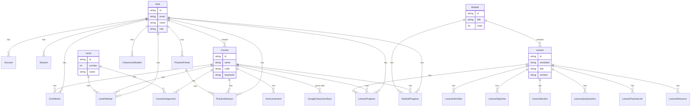
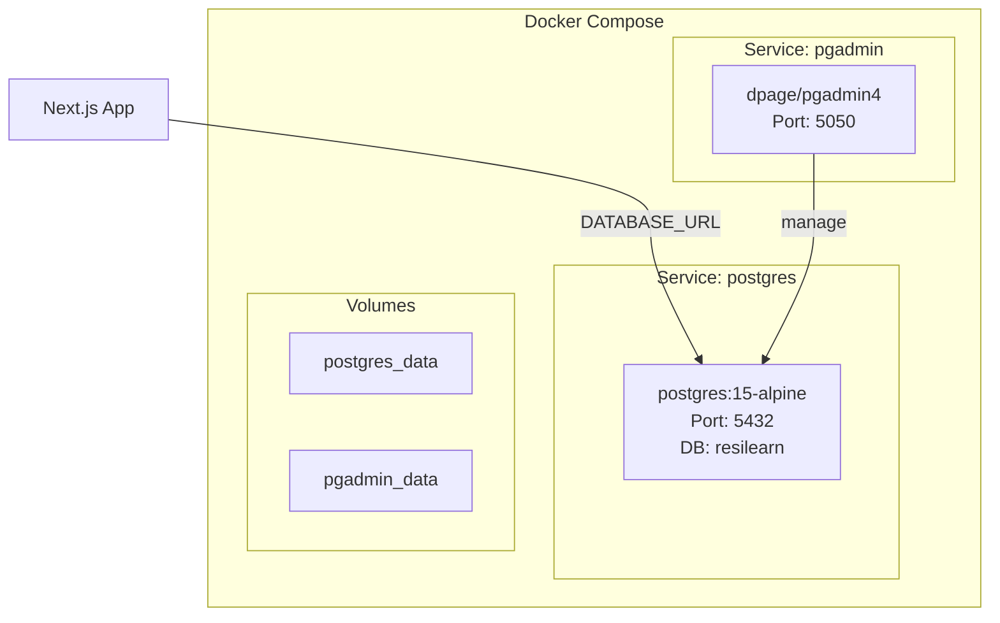

# ResiLearn - Tech Stack (Mermaid Diagrams)

---

## ฉบับย่อ (สำหรับกรรมการ)

**สรุปหนึ่งบรรทัด:** ใช้ **Next.js + React** ทำเว็บ, **PostgreSQL** เก็บข้อมูล, **NextAuth** จัดการล็อกอิน, **Prisma** คุยกับฐานข้อมูล, **Google Classroom API** ซิงค์ชั้นเรียน และ **Three.js** แสดงตัวต้านทาน 3 มิติ

```mermaid
flowchart TB
  subgraph ฝั่งผู้ใช้["🖥️ ฝั่งผู้ใช้ (เว็บ)"]
    A[Next.js + React<br/>เว็บแอปหลัก]
    B[Tailwind + shadcn/ui<br/>หน้าตาและปุ่ม]
    C[Three.js<br/>โมเดล 3D ตัวต้านทาน]
  end

  subgraph ฝั่งเซิร์ฟเวอร์["⚙️ ฝั่งเซิร์ฟเวอร์"]
    D[NextAuth<br/>ล็อกอิน / บัญชี]
    E[Prisma<br/>จัดการข้อมูล]
  end

  subgraph ข้อมูล["🗄️ ข้อมูล"]
    F[(PostgreSQL<br/>ฐานข้อมูล)]
  end

  subgraph เสริม["🔌 บริการภายนอก"]
    G[Google Classroom<br/>ซิงค์งาน/ชั้นเรียน]
  end

  ฝั่งผู้ใช้ --> ฝั่งเซิร์ฟเวอร์
  ฝั่งเซิร์ฟเวอร์ --> ข้อมูล
  ฝั่งเซิร์ฟเวอร์ --> เสริม
```

| ชั้น | เทคโนโลยี | หน้าที่โดยย่อ |
|-----|-----------|----------------|
| **เว็บ (Frontend)** | Next.js 16, React 19 | ฟрейมเวิร์กเว็บหลัก |
| | Tailwind CSS, shadcn/ui | ดีไซน์และคอมโพเนนต์ UI |
| | Three.js | แสดงโมเดล 3D ตัวต้านทาน |
| | Recharts | กราฟวิเคราะห์/สถิติ |
| **เซิร์ฟเวอร์ (Backend)** | NextAuth | ล็อกอิน (อีเมล, Google) |
| | Prisma | อ่าน/เขียนฐานข้อมูลแบบ type-safe |
| **ฐานข้อมูล** | PostgreSQL 15 | เก็บผู้ใช้, คอร์ส, ความคืบหน้า, ปฏิบัติ |
| **เชื่อมต่อภายนอก** | Google Classroom API | ซิงค์ชั้นเรียนและงาน |
| **เครื่องมือพัฒนา** | TypeScript, Docker | โค้ด type-safe, รัน DB ในคอนเทนเนอร์ |

---

## 1. สรุปภาพรวม Tech Stack (Block Diagram)



---

## 2. Tech Stack แบบแบ่งชั้น (Flowchart - สมบูรณ์)



---

## 3. Tech Stack แบบ Mind Map (ลำดับชั้น)

```mermaid
mindmap
  root((ResiLearn<br/>Tech Stack))

  Frontend
    Framework
      Next.js 16
      React 19
      App Router
    Styling
      Tailwind CSS 4
      shadcn/ui
      Radix UI
      CVA, clsx, tailwind-merge
    Animation & 3D
      Framer Motion
      Three.js
      React Three Fiber
      Drei, PostProcessing
      react-spring
      lamina, maath
    Data & State
      TanStack Query
      TanStack Table
      Zustand
    Forms & Validation
      React Hook Form
      Zod
      @hookform/resolvers
    Content
      Tiptap
      react-markdown
      remark-gfm, rehype-raw
    Charts & UX
      Recharts
      lucide-react
      canvas-confetti
      sonner
      date-fns
    Documents
      docx
      mammoth
    Security & Utils
      DOMPurify
      bcryptjs
      bad-words
      nanoid

  Backend
    Auth
      NextAuth.js v5
      @auth/prisma-adapter
      bcryptjs
    API
      Next.js API Routes
      Server Actions

  Data
    ORM
      Prisma 6.x
    Database
      PostgreSQL 15

  Integration
    Google
      googleapis
      Google Classroom API

  Infrastructure
    Docker
      postgres:15-alpine
      pgAdmin 4
    Volumes
      postgres_data
      pgadmin_data

  DevTools
    TypeScript 5
    ESLint 9
    tsx
    Prisma Studio
    @react-three/gltfjsx
    leva
```

---

## 4. สถาปัตยกรรมแบบง่าย (C4-style)



---

## 5. ตาราง Dependencies หลัก (อ้างอิงจาก package.json)

| หมวด | Package | เวอร์ชัน | หน้าที่ |
|------|---------|----------|---------|
| **Core** | next | 16.0.1 | Full-stack framework, App Router |
| | react, react-dom | 19.2.0 | UI library |
| **Auth** | next-auth | 5.0.0-beta.30 | Authentication |
| | @auth/prisma-adapter | ^2.11.1 | Prisma session adapter |
| | bcryptjs | ^3.0.2 | Password hashing |
| **Data** | @prisma/client | ^6.18.0 | ORM, type-safe DB client |
| **UI/Styling** | tailwindcss | ^4 | Utility-first CSS |
| | @radix-ui/react-dialog | ^1.1.15 | Accessible primitives |
| | @tailwindcss/typography | ^0.5.19 | Prose styles |
| | class-variance-authority | ^0.7.1 | Component variants |
| | clsx | ^2.1.1 | Class names |
| | tailwind-merge | ^3.4.0 | Merge Tailwind classes |
| **3D & Animation** | three | ^0.181.0 | WebGL/3D |
| | @react-three/fiber | ^9.4.0 | React renderer for Three |
| | @react-three/drei | ^10.7.6 | Helpers |
| | @react-three/postprocessing | ^3.0.4 | Effects |
| | @react-spring/three | ^10.0.3 | Physics-based animation |
| | framer-motion | ^12.23.24 | Animations |
| | framer-motion-3d | ^12.4.13 | 3D motion |
| | lamina | ^1.2.2 | Layered materials (Three) |
| | maath | ^0.10.8 | Math utilities (3D) |
| **Forms** | react-hook-form | ^7.65.0 | Form state |
| | zod | ^4.1.12 | Schema validation |
| | @hookform/resolvers | ^5.2.2 | RHF + Zod |
| **State & Data Fetching** | @tanstack/react-query | ^5.90.5 | Server state, cache |
| | @tanstack/react-table | ^8.21.3 | Tables, sorting, filter |
| | zustand | ^5.0.8 | Client state |
| **Rich Text** | @tiptap/react | ^2.1.13 | Editor |
| | @tiptap/starter-kit | ^2.1.13 | Extensions |
| **Markdown** | react-markdown | ^10.1.0 | Render Markdown |
| | remark-gfm | ^4.0.1 | GFM (tables, etc.) |
| | rehype-raw | ^7.0.0 | Raw HTML in MD |
| **Charts** | recharts | ^3.3.0 | Charts |
| **Integration** | googleapis | ^164.1.0 | Google Classroom |
| **Utils** | date-fns | ^4.1.0 | Date formatting |
| | docx | ^8.5.0 | Word export |
| | mammoth | ^1.6.0 | Word import |
| | dompurify | ^3.0.6 | XSS sanitization |
| | nanoid | ^5.1.6 | IDs |
| | bad-words | ^4.0.0 | Profanity filter |
| | canvas-confetti | ^1.9.4 | Confetti effect |
| | sonner | ^2.0.7 | Toasts |
| | lucide-react | ^0.552.0 | Icons |

---

## 6. Database Schema (Prisma Models - สรุป)



---

## 7. Infrastructure (Docker)



---

## 8. การใช้ Diagram ใน Markdown / Notion / Confluence

- **Mermaid Live Editor:** https://mermaid.live  
- **VS Code:** ใช้ extension "Markdown Preview Mermaid Support" หรือ "Mermaid"  
- **GitHub / GitLab:** รองรับ Mermaid ใน Markdown โดยตรง  
- **Notion:** ใช้ /code และเลือก Mermaid หรือใช้ block จากบริการ Mermaid

---

*อัปเดตจาก `package.json`, `prisma/schema.prisma`, `docker-compose.yml` และ `Documentation/tech-stack.md` (ม.ค. 2025)*
